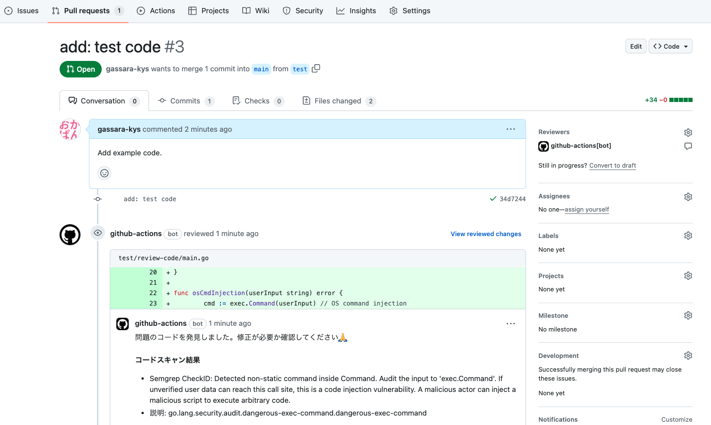

# security-review

Security Code Review using GitHub Actions 🤖.

- **SecretScanning**: Scan for sensitive information committed to source code.
- **CodeScanning**: Perform static analysis of source code to identify problem areas.
- **Comment**: Put review comments on PRs.



This tool allows you to shift-left security in your development environment💪

## Usage

Create workflow yaml (`.github/workflows/security-review.yaml`) on your repository.

```yaml
name: Security Code Review on PR
on:
  pull_request:
    branches:
      - main
    types: [opened, synchronize]
jobs:
  review:
    runs-on: ubuntu-latest
    permissions:
      contents: read
      pull-requests: write # risken review needs this permission to create a comment on the PR

    steps:
      - uses: actions/checkout@v4
      - uses: ca-risken/security-review@v1
        env:
          GITHUB_TOKEN: ${{ secrets.GITHUB_TOKEN }}
```

## Integrate RISKEN.

[RISKEN](https://docs.security-hub.jp/) is a platform for collecting security issues; Findings detected by Actions can be linked to the RISKEN environment for issue management, alerting, information sharing to the team, and analysis results from the generated AI.

(あとで書く。。。)

## Test on local

### Generate ENV file

```shell
$ cp .env.sample .env
$ vi .env # fix your token
```

### Use Docker

```shell
$ make run
```

### See your comment

https://github.com/ca-risken/security-review/pull/1

## Push image

```shell
$ make push TAG=v1
```

