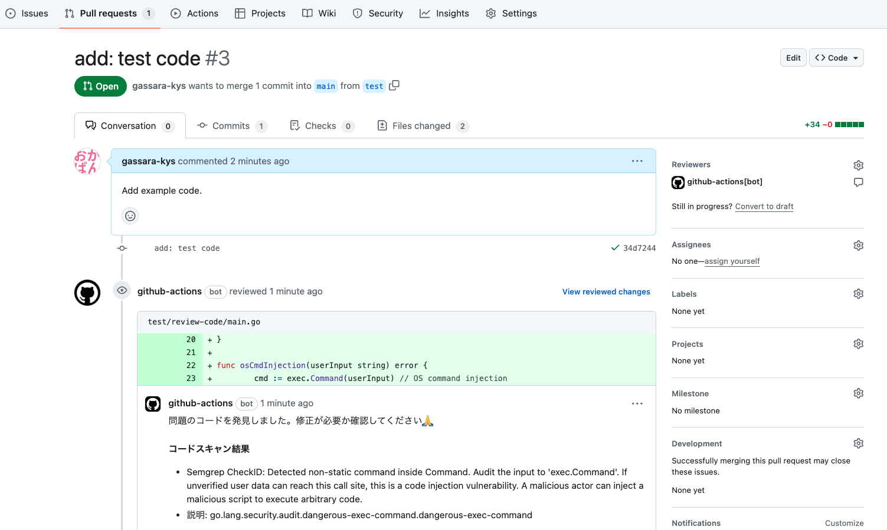

# security-review

Security Code Review using GitHub Actions 🤖.

- **SecretScanning**: Scan for sensitive information committed to source code.
- **CodeScanning**: Perform static analysis of source code to identify problem areas.
- **Comment**: Put review comments on PRs.



This tool allows you to shift-left security in your development environment💪

## Usage

Create workflow yaml (`.github/workflows/security-review.yaml`) on your repository.

```yaml
name: Security Code Review on PR
on:
  pull_request:
    branches:
      - main
    types: [opened, synchronize]
jobs:
  review:
    runs-on: ubuntu-24.04-arm
    permissions:
      contents: read
      pull-requests: write # risken review needs this permission to create a comment on the PR

    steps:
      - uses: actions/checkout@v5
      - uses: ca-risken/security-review@v1
        with:
          github_token: ${{ secrets.GITHUB_TOKEN }}
```

## Integrate RISKEN

[RISKEN](https://docs.security-hub.jp/) is a platform for collecting security issues; Findings detected by Actions can be linked to the RISKEN environment for issue management, alerting, information sharing to the team, and analysis results from the generated AI.

```yaml
- uses: ca-risken/security-review@v1
  with:
    github_token: ${{ secrets.GITHUB_TOKEN }}
    risken_console_url: ${{ env.RISKEN_CONSOLE_URL }}
    risken_api_endpoint: ${{ env.RISKEN_API_ENDPOINT }}
    risken_api_token: ${{ secrets.RISKEN_API_TOKEN }}
```

| Pameters | Description | Required | Default | Examples |
| ---- | ---- | ---- | ---- | ---- |
| `risken_console_url` | RISKEN Console URL | `no` | | https://console.your-env.com |
| `risken_api_endpoint` | RISKEN API Endpoint | `no` | | https://api.your-env.com |
| `risken_api_token` | RISKEN API Token | `no` | | xxxxx |

## Other Options

```yaml
- uses: ca-risken/security-review@v1
  with:
    github_token: ${{ secrets.GITHUB_TOKEN }}
    options: '--no-pr-comment --error'
```

| Pameters | Description | Required | Default | Examples |
| ---- | ---- | ---- | ---- | ---- |
| `--no-pr-comment` | If true, do not post PR comments (default: false) | `no` | `false` | |
| `--error` | Exit 1 if there are finding (default: false) | `no` | `false` | |

## Ignore Semgrep findings

If you want to exclude specific files or folders from Semgrep scans, create a `.semgrepignore` file in the repository root.

```text
# .semgrepignore
vendor/
generated/
path/to/file.go
```

If you want to ignore only a specific code block, add a `nosemgrep` comment.

```go
// nosemgrep
cmd := exec.Command(userInput) // ignored by Semgrep
_ = cmd.Run()
```

You can also ignore a specific rule only.

```go
// nosemgrep: go.lang.security.audit.dangerous-exec-command.dangerous-exec-command
cmd := exec.Command(userInput) // ignored only for this rule
_ = cmd.Run()
```

Example:

```go
func run(userInput string) error {
	// Ignore all Semgrep rules for this line
	// nosemgrep
	cmd1 := exec.Command(userInput)
	if err := cmd1.Run(); err != nil {
		return err
	}

	// Ignore only the dangerous-exec-command rule
	// nosemgrep: go.lang.security.audit.dangerous-exec-command.dangerous-exec-command
	cmd2 := exec.Command(userInput)
	if err := cmd2.Run(); err != nil {
		return err
	}

	return nil
}
```

See the official Semgrep documentation for details about `.semgrepignore` syntax and inline ignore comments:

- https://semgrep.dev/docs/ignoring-files-folders-code
- https://semgrep.dev/docs/semgrepignore-v2-reference

## Test on local

### Command Line Usage

```shell
$ go run main.go --help
risken-review command is a GitHub Custom Action to review pull request with Risken

Usage:
  risken-review [flags]

Flags:
      --error                        Exit 1 if there are findings (optional)
      --github-event-path string     GitHub event path
      --github-token string          GitHub token
      --github-workspace string      GitHub workspace path
  -h, --help                         help for risken-review
      --no-pr-comment                If true, do not post PR comments (optional)
      --risken-api-endpoint string   RISKEN API endpoint (optional)
      --risken-api-token string      RISKEN API token for authentication (optional)
      --risken-console-url string    RISKEN Console URL (optional)
```

### Use Docker

#### Preparation

```shell
$ cp .env.sample .env
$ vi .env # fix your token
```

#### Run docker

```shell
$ make run
```

#### See your test comment

https://github.com/ca-risken/security-review/pull/1

## Push image for v1

```shell
$ make push TAG=v1
```
